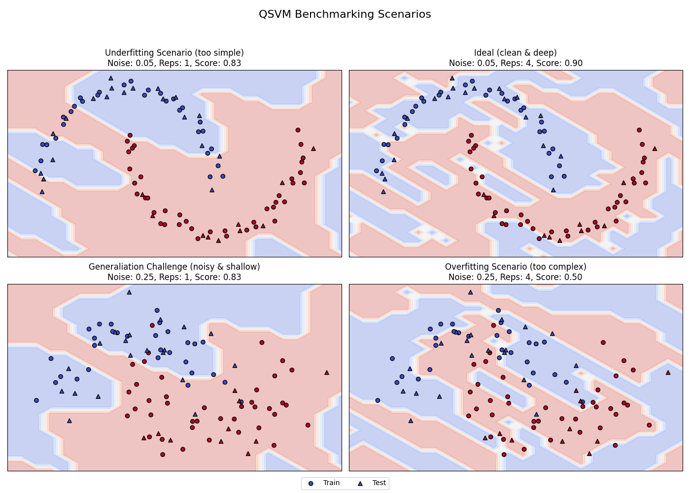

# Quantum Support Vector Machine (QSVM) Benchmark

A comprehensive study on **Quantum Kernel Methods** for non-linear classification. This project investigates the trade-offs between **quantum circuit complexity**, **expressibility**, and **noise robustness** in the NISQ (Noisy Intermediate-Scale Quantum) era.


## Project Overview

In classical Machine Learning, Support Vector Machines (SVMs) often use the "Kernel Trick" to separate non-linear data by projecting it into a higher-dimensional space. In Quantum Machine Learning (QML), we leverage the **Hilbert Space** of a quantum processor to perform this mapping naturally.

**The Goal:**
To classify the "Two Moons" dataset (non-linear) using a **Quantum Fidelity Kernel** and analyze how **Circuit Depth** (complexity) and **Data Noise** affect model performance.

## Theoretical Background

We utilize a **Quantum Feature Map** ($\phi$) to encode classical data $\vec{x}$ into a quantum state $|\phi(\vec{x})\rangle$. The similarity between two data points is computed via the overlap (fidelity) of their quantum states:

$$K(\vec{x}_i, \vec{x}_j) = |\langle \phi(\vec{x}_i) | \phi(\vec{x}_j) \rangle|^2$$

* **Feature Map:** I use the `ZZFeatureMap`, which introduces entanglement between qubits.
* **Circuit Depth (`reps`):** Controls the number of repeated entanglement layers. Higher depth = higher expressibility but higher susceptibility to noise.

---

## The Benchmark Experiment

I conducted a 2x2 matrix experiment to isolate the variables of **Noise** and **Model Complexity**.

* **Dataset:** `make_moons` (100 samples).
* **Variables:**
    * **Noise Level:** Low (0.05) vs. High (0.25).
    * **Circuit Complexity:** Shallow (`reps=1`) vs. Deep (`reps=4`).

### Results & Analysis

The following matrix visualizes the decision boundaries for each scenario:



### Detailed Analysis of Scenarios

| Scenario | Conditions | Accuracy | Analysis (The "Why") |
| :--- | :--- | :--- | :--- |
| **1. Underfitting** (Top-Left) | Low Noise <br> Shallow Circuit | **0.83** | **Lack of Expressibility.** The model is too simple (`reps=1`). Even with clean data, the quantum circuit lacks the mathematical capacity to curve the decision boundary perfectly around the moons. It yields a "stiff" boundary. |
| **2. The Ideal Case** (Top-Right) | Low Noise <br> Deep Circuit | **0.90** | **The Sweet Spot.** With clean data and a powerful circuit (`reps=4`), the model utilizes high entanglement to map the complex non-linear geometry perfectly. This represents the potential advantage of QML. |
| **3. Robustness** (Bottom-Left) | High Noise <br> Shallow Circuit | **0.83** | **Generalization.** Surprisingly effective. Because the circuit is simple, it *cannot* learn the complex noise patterns. It is forced to learn the general structure of the data, acting as a natural regularizer against noise. |
| **4. Overfitting** (Bottom-Right) | High Noise <br> Deep Circuit | **0.50** | **The NISQ Trap.** The model is too powerful for the noisy data. Instead of learning the moons, it memorizes the random noise (overfitting), creating disjointed "islands" of decision regions. The performance collapses to random guessing. |

---

## Key Takeaways

1.  **Complexity is a Double-Edged Sword:** In Quantum ML, increasing circuit depth (`reps`) improves performance on clean data but leads to catastrophic overfitting on noisy data.
2.  **Quantum Regularization:** Shallower circuits can sometimes outperform deeper ones in high-noise environments by forcing simpler decision boundaries.
3.  **Data Quality:** The quality of the dataset (Signal-to-Noise ratio) is as critical as the algorithm itself.

## Installation & Usage

### Prerequisites
* Python 3.10+
* Qiskit 1.0+
* Scikit-Learn, Matplotlib

### Setup
```bash
# Clone the repository
git clone https://github.com/numaguiot/qsvm-benchmark.git
cd qsvm-benchmark

# Create virtual environment
python3 -m venv .venv
source .venv/bin/activate

# Install dependencies
pip install qiskit qiskit-machine-learning scikit-learn matplotlib
```
### Run the Benchmark
```bash
python qsvm_benchmark.py
```

## Author
**Numa Guiot**
- [https://www.linkedin.com/in/numaguiot/](https://www.linkedin.com/in/numaguiot/)
- Built with IBM Qiskit & Scikit-Learn

## License
Academic Project - Open Source (MIT License)